# Homework 1 CA - Introduction to Machine Learning

Grade and final result prediction on the Open University Learning Analytics Dataset (OUALD).

---

# 3.1 Exploratory Data Analysis

## Attribute types

The 43 columns split into:

- 31 continuous numeric features (scores, click counts, registration dates, `macro_stats`)
- 10 discrete / categorical features (`code_module`, `code_presentation`, `gender`, `region`, `highest_education`, `imd_band`, `age_band`, `disability`, `clicks_freq_init`, `num_of_prev_attempts`)
- 2 targets (`final_result`, `final_coursework_score`)

Statistics tables and boxplots / histograms are produced in section 2.1 of the notebook for all of them. Key takeaways:

- Most click columns are extremely sparse: `clicks_dataplus`, `clicks_repeatactivity`, `clicks_sharedsubpage`, `clicks_dualpane`, `clicks_glossary`, `clicks_externalquiz`, `clicks_questionnaire` have median = Q1 = Q3 = 0. The IQR is zero, so the standard 1.5 * IQR outlier rule would flag every non-zero value as an outlier. We handle this in preprocessing (see 3.2).
- `final_coursework_score` is left-skewed: median 73, P25 61, P75 83. The bulk of students score above 60.
- `date_unregistration` is missing for ~80% of rows, because most students never unregister. The "missingness" is informative.

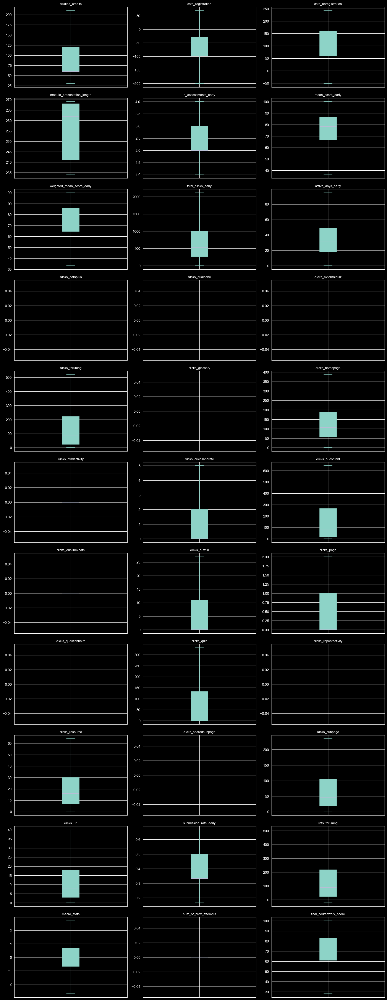

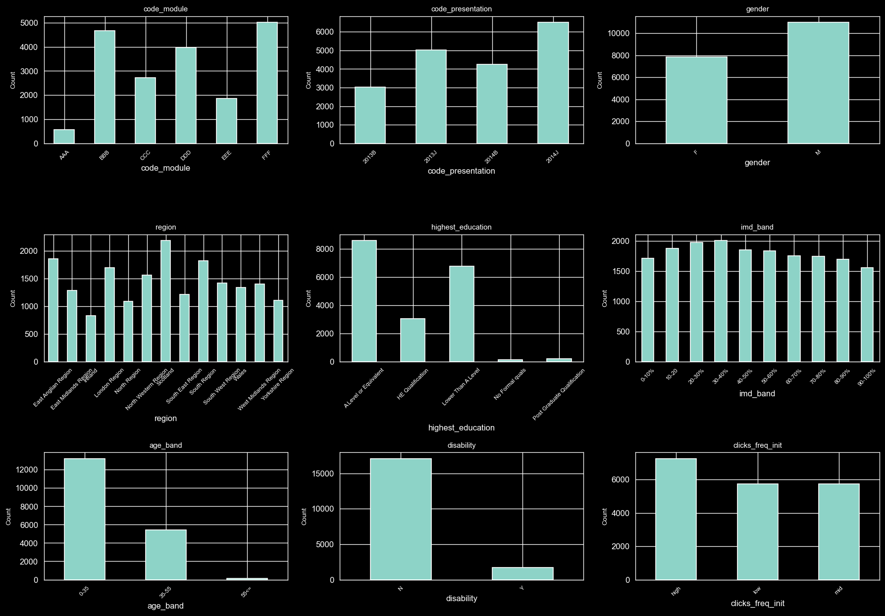

## Class balance

`final_result` is unbalanced:

| Class       | Train share |
|-------------|-------------|
| Pass        | ~48%        |
| Withdrawn   | ~19%        |
| Fail        | ~22%        |
| Distinction | ~11%        |

Because the dataset is unbalanced, accuracy alone would be misleading: a model that always predicts `Pass` would score around 48% accuracy without learning anything. We therefore track macro precision, macro recall and macro F1 alongside accuracy.

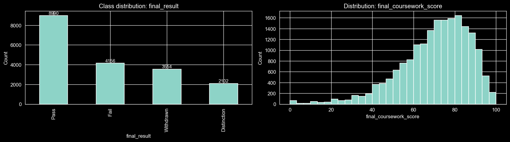

## Correlation analysis

### Numeric vs numeric (Pearson)

The Pearson heatmap surfaces several near-duplicate pairs:

- `weighted_mean_score_early` vs `mean_score_early`: r ~ 0.89
- `weighted_mean_score_early` vs `final_coursework_score`: r ~ 0.90
- `submission_rate_early` vs `n_assessments_early`: r ~ 1.00 (deterministic)
- `refs_forumng` vs `clicks_forumng`: r ~ 0.76
- `active_days_early` vs `total_clicks_early`: r ~ 0.78

Single strongest linear predictor of both targets: `mean_score_early`.

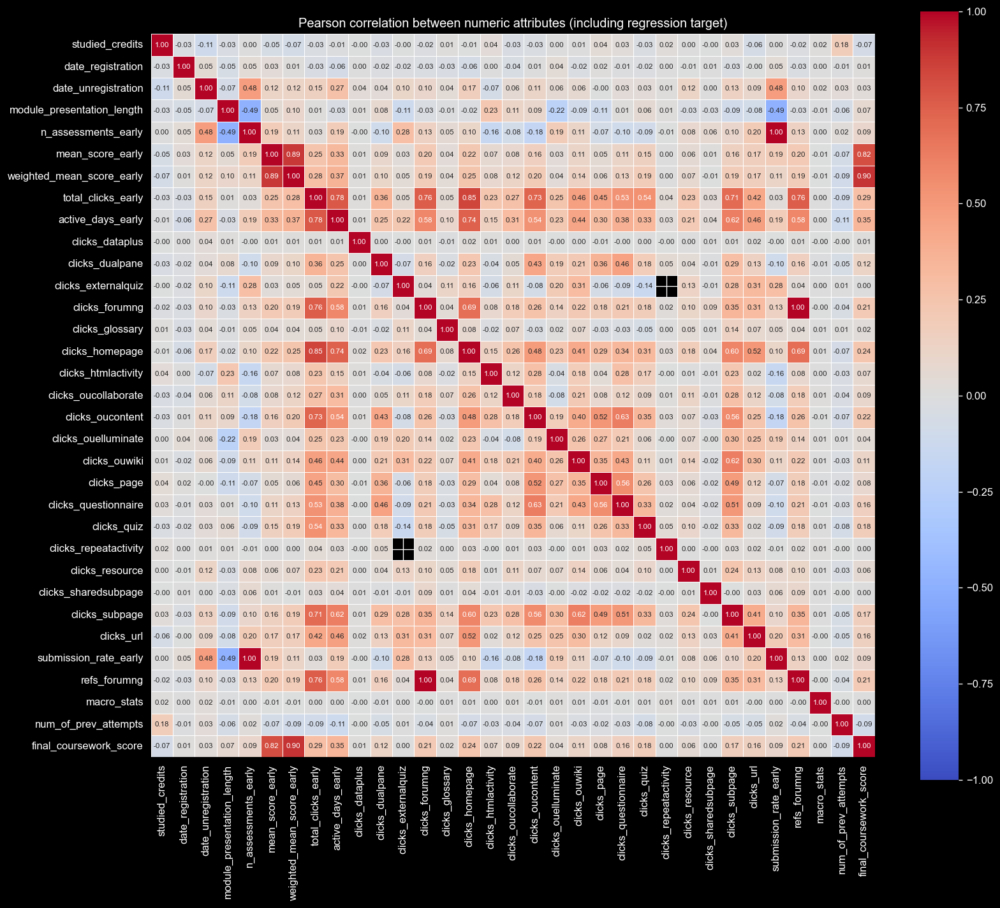

### Categorical vs categorical (Chi-square)

Almost every pair of categorical features comes back significant at p < 0.05, which is expected given the sample size (~19k rows makes even tiny dependencies significant). We therefore use the chi-square table as a sanity check, not as a feature-selection signal on its own.

### Mixed (target vs feature)

- Numeric vs classification: `mean_score_early` differs sharply between classes (ANOVA p ~ 0).
- Categorical vs classification: `highest_education` is strongly associated with `final_result` (chi-square p ~ 0): higher education levels skew towards Pass / Distinction.
- Numeric vs regression: `mean_score_early` correlates strongly with `final_coursework_score` (r ~ 0.82).
- Categorical vs regression: `highest_education` shows clear differences in score distributions across levels (ANOVA p ~ 0).

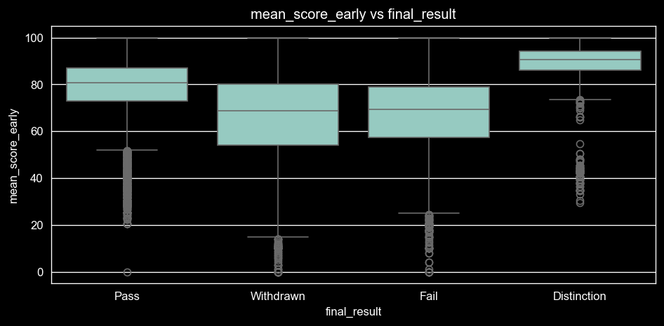

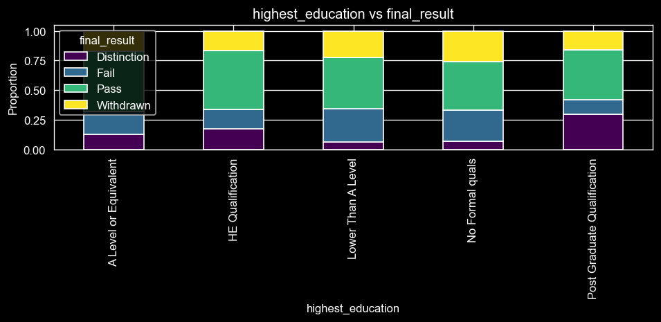

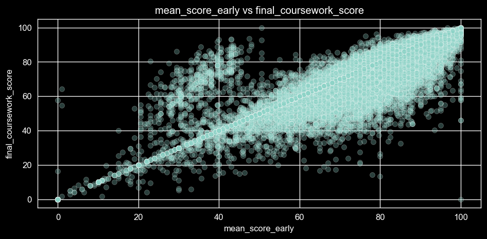

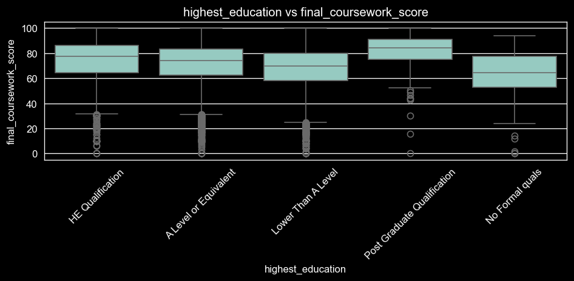

## Interpretation - decisions taken from EDA

1. We drop one feature from each strongly-correlated pair, keeping the version that correlates more with the target. Specifically: drop `weighted_mean_score_early` (keep `mean_score_early`), drop `submission_rate_early` (keep `n_assessments_early`), drop `refs_forumng` (keep `clicks_forumng`), drop `active_days_early` (keep `total_clicks_early`).
2. We drop columns that are essentially constant after capping (`clicks_dataplus`, `clicks_repeatactivity`, `clicks_sharedsubpage`).
3. For the very sparse click columns we use a 99th-percentile cap rather than 1.5 * IQR.
4. We engineer `did_unregister` from `date_unregistration` rather than imputing the date itself.

---

# 3.2 Preprocessing

| Step                            | Decision                                                                                                                                                                                                                   | Justification                                                                                                                                                                                                         |
|---------------------------------|----------------------------------------------------------------------------------------------------------------------------------------------------------------------------------------------------------------------------|-----------------------------------------------------------------------------------------------------------------------------------------------------------------------------------------------------------------------|
| Missing - numeric               | Median imputation, fitted on train only                                                                                                                                                                                    | Robust to the heavy right-skew seen in click distributions; the mean would be dragged by outliers.                                                                                                                    |
| Missing - categorical           | Most-frequent imputation, fitted on train only                                                                                                                                                                             | Standard choice for low-cardinality discrete variables; only `imd_band` and `clicks_freq_init` had non-trivial missing counts.                                                                                        |
| Missing - `date_unregistration` | Replaced with `did_unregister` (binary 0/1)                                                                                                                                                                                | ~80% missing; the missingness itself encodes "this student did not drop out", which is a strong signal.                                                                                                               |
| Outliers                        | IQR cap (Q1 - 1.5 IQR, Q3 + 1.5 IQR) where IQR > 0; otherwise cap at 99th percentile                                                                                                                                       | The standard rule fails on sparse click columns where Q1 = Q3 = 0. The percentile cap clips only the very heavy tail. Bounds are fitted on train and applied unchanged to validation.                                 |
| Redundant features              | Drop one column from each strongly-correlated pair (see 3.1) plus columns that became constant after capping                                                                                                               | Keep the column with the higher correlation to the targets to preserve predictive power while reducing dimensionality.                                                                                                |
| Categorical encoding            | Ordinal map for naturally-ordered features (`highest_education`, `imd_band`, `age_band`, `clicks_freq_init`); one-hot for nominal (`code_module`, `code_presentation`, `gender`, `region`, `disability`, `did_unregister`) | The order in `highest_education` and `imd_band` carries meaning, so an ordinal encoding preserves it without inflating dimensionality. `num_of_prev_attempts` is kept as a numeric integer.                           |
| Standardization                 | `StandardScaler` on every numeric column (continuous + ordinal-encoded + integer), fitted on train                                                                                                                         | Required for Logistic Regression, Ridge and Lasso, otherwise the click counts (range 0-7000) dominate the linear combination over the scores (0-100). Tree-based models are scale-invariant so it does not hurt them. |

Train/validation isolation: every transformer (imputer, outlier bounds, encoder, scaler) is fitted on the train set only and applied to validation, which prevents test-set leakage.

---

# 3.3 Modeling and evaluation

## Classification

### Hyperparameters used

| Algorithm                           | Final hyperparameters                                                       |
|-------------------------------------|-----------------------------------------------------------------------------|
| Decision Tree (baseline)            | `max_depth=3`, `random_state=42`                                            |
| Decision Tree (best after ablation) | `max_depth=10`, `min_samples_leaf=20`, `random_state=42`                    |
| Random Forest                       | `n_estimators=200`, `max_depth=15`, `min_samples_leaf=5`, `random_state=42` |
| Logistic Regression                 | `C=1.0`, `max_iter=2000`, default L2                                        |
| Logistic Regression (regularized)   | `C=0.1`, `max_iter=2000`, default L2                                        |

### Decision Tree ablation

We varied `max_depth` in {3, 5, 10, 20} and `min_samples_leaf` in {1, 5, 20}:

| max_depth | min_samples_leaf | Accuracy  | F1 (macro) |
|-----------|------------------|-----------|------------|
| 3         | *                | 0.703     | 0.514      |
| 5         | *                | 0.725     | 0.597      |
| 10        | 1                | 0.736     | 0.686      |
| 10        | 5                | 0.733     | 0.685      |
| **10**    | **20**           | **0.740** | **0.693**  |
| 20        | 1                | 0.670     | 0.644      |
| 20        | 5                | 0.679     | 0.658      |
| 20        | 20               | 0.712     | 0.684      |

Reading: depth 3 underfits massively (recall on minority classes collapses), depth 20 with a single-sample leaf overfits (~7 F1 points lost between train and val), and the sweet spot is depth 10 with `min_samples_leaf=20`, which forces leaves to contain meaningful subgroups.

### Comparison across algorithms

| Model                       | Accuracy  | Precision (macro) | Recall (macro) | F1 (macro) |
|-----------------------------|-----------|-------------------|----------------|------------|
| DT baseline (depth 3)       | 0.703     | 0.638             | 0.542          | 0.514      |
| **DT best (d=10, leaf=20)** | 0.740     | 0.736             | **0.673**      | **0.693**  |
| Random Forest               | **0.751** | **0.800**         | 0.640          | 0.663      |
| Logistic Regression         | 0.743     | 0.766             | 0.654          | 0.679      |
| Logistic Regression (C=0.1) | 0.742     | 0.766             | 0.651          | 0.676      |

### Confusion matrices

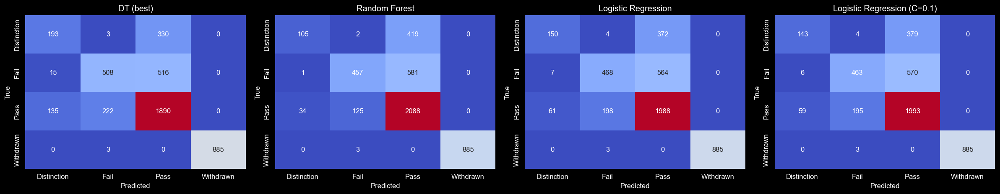

### Per-class precision / recall / F1 (validation)

| Model               | Distinction P/R/F1 | Fail P/R/F1        | Pass P/R/F1        | Withdrawn P/R/F1   |
|---------------------|--------------------|--------------------|--------------------|--------------------|
| DT best             | 0.56 / 0.37 / 0.44 | 0.69 / 0.49 / 0.57 | 0.69 / 0.84 / 0.76 | 1.00 / 1.00 / 1.00 |
| Random Forest       | 0.75 / 0.20 / 0.31 | 0.78 / 0.44 / 0.56 | 0.68 / 0.93 / 0.78 | 1.00 / 1.00 / 1.00 |
| Logistic Regression | 0.69 / 0.28 / 0.40 | 0.69 / 0.45 / 0.55 | 0.68 / 0.89 / 0.77 | 1.00 / 1.00 / 1.00 |

### Interpretation

- **Effect of class imbalance.** Every model handles `Withdrawn` perfectly (P/R ~ 1.0) because `did_unregister` is essentially deterministic for that class. `Pass` is also easy because it is the majority class. `Fail` and especially `Distinction` are hard: their recall sits between 0.20 and 0.49 because the models prefer the majority class on borderline cases.
- **Effect of hyperparameters.** For the Decision Tree the difference between depth 3 and depth 10 is almost 18 macro F1 points, while between depth 10 and depth 20 we lose ~5 points (overfitting). `min_samples_leaf` is the second-most-impactful knob: at depth 20 it is the difference between F1 0.64 and F1 0.68. Random Forest is much less sensitive to hyperparameters thanks to bagging. Logistic Regression is essentially insensitive to `C` in this range, which means it was not overfitting.
- **Best class predictions.** `Withdrawn` and `Pass` are the easiest. `Distinction` is the hardest across the board.
- **Best classifier.** If we go by macro F1 (the right metric for imbalanced data), the tuned Decision Tree wins because of its better minority-class recall. If we go by raw accuracy, Random Forest wins because it correctly classifies more `Pass` and `Fail` cases at the cost of recall on `Distinction`.

## Regression

### Hyperparameters used

| Algorithm                   | Final hyperparameters                                                      |
|-----------------------------|----------------------------------------------------------------------------|
| Linear Regression           | default                                                                    |
| Ridge                       | alpha sweep: {0.001, 0.01, 0.1, 1, 10, 100}                                |
| Lasso                       | alpha sweep: {0.001, 0.01, 0.1, 1, 10, 100}, `max_iter=10000`              |
| Gradient Boosting Regressor | `n_estimators=300`, `max_depth=4`, `learning_rate=0.05`, `random_state=42` |

### Comparison

| Model                 | Train MAE | Val MAE  | Train RMSE | Val RMSE | Train R^2 | Val R^2   |
|-----------------------|-----------|----------|------------|----------|-----------|-----------|
| Linear Regression     | 6.93      | 7.05     | 9.83       | 9.93     | 0.660     | 0.630     |
| Ridge alpha=1         | 6.93      | 7.05     | 9.83       | 9.93     | 0.660     | 0.630     |
| Ridge alpha=100       | 6.93      | 7.05     | 9.83       | 9.92     | 0.660     | 0.631     |
| Lasso alpha=0.01      | 6.92      | 7.04     | 9.83       | 9.92     | 0.659     | 0.631     |
| Lasso alpha=1         | 7.14      | 7.20     | 10.13      | 10.09    | 0.638     | 0.618     |
| Lasso alpha=100       | 13.19     | 12.92    | 16.85      | 16.33    | 0.000     | 0.000     |
| **Gradient Boosting** | **5.34**  | **5.81** | **7.39**   | **8.04** | **0.808** | **0.757** |

### Train vs validation curves

The notebook plots Ridge and Lasso train MSE vs validation MSE on the same axes (section 5.3). For Ridge the two curves are almost flat and overlap, indicating no overfitting and no real benefit from regularization in our setup. For Lasso the curves diverge once alpha exceeds ~1: train MSE rises faster than val MSE because L1 starts zeroing out useful features. At alpha=100 the model collapses to the mean predictor.

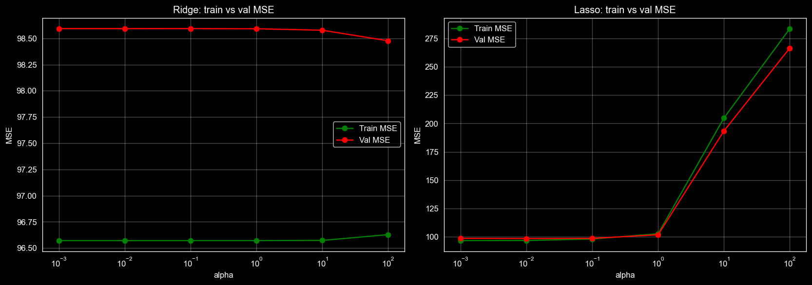

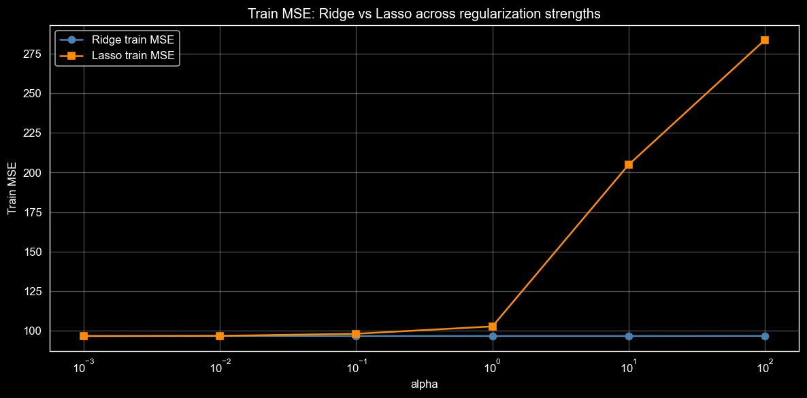

### Interpretation

- **Effect of regularization.** Linear Regression, Ridge and Lasso with small alpha all converge to essentially the same answer (Val R^2 ~ 0.63). The reason is that the most multicollinear columns were already dropped in 3.2, so L2 has very little to fix. Ridge with alpha=10-100 gives a marginal Val R^2 improvement (third decimal). Lasso with alpha >= 1 underfits and at alpha=100 it produces the constant mean predictor.
- **Best regressor.** Gradient Boosting wins by a wide margin (Val R^2 0.757 vs ~0.63). It captures non-linear interactions that the linear models cannot represent, especially the interaction between `mean_score_early`, click counts and `did_unregister`. The 5-point gap between train and val R^2 (0.81 vs 0.76) shows mild overfitting, but the validation R^2 is still much higher than any linear model. We could regularize it further by lowering `n_estimators` or `max_depth`, but the gap is small enough not to be a concern.
- **What it learns from.** `mean_score_early` and the click totals dominate the feature importance: students who already perform well early and engage with the platform are predictably the ones who score high on the final coursework.

---

# Final summary

| Task                      | Best model                                            | Validation metric              |
|---------------------------|-------------------------------------------------------|--------------------------------|
| Classification (macro F1) | Decision Tree (`max_depth=10`, `min_samples_leaf=20`) | F1 macro 0.693, accuracy 0.740 |
| Classification (accuracy) | Random Forest                                         | accuracy 0.751, F1 macro 0.663 |
| Regression                | Gradient Boosting                                     | R^2 0.757, MAE 5.81, RMSE 8.04 |

The largest single contributor to model quality was the preprocessing step that converted `date_unregistration` into a `did_unregister` indicator: this single binary column makes the `Withdrawn` class trivially predictable. The second-largest contributor was the change of outlier rule for sparse click columns: the naive 1.5 IQR rule was wiping out the actual signal in those columns.
